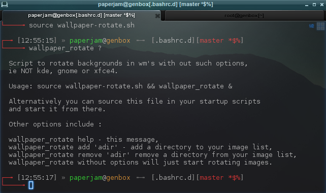

## dot.files tdm 2016

#### [dot.files](dot.files)
* Shell, X setup, bin, sbin (maintenance scripts)
  * [.bashrc.d](dot.files/.bashrc.d) is customizations of [Durag](http://dotshare.it/~Durag/)'s [Improved Terminal](http://dotshare.it/dots/1027/) at [http://dotshare.it/](http://dotshare.it/)
  * [plug-dots.sh](dot.files/bin/plug-dots.sh)
    The means to migrate my .dots in new systems.
* Some WM's
* Backup includes - excludes
* Editors - Utilities
  If emacs is "your thing", check one of ...
    * https://github.com/technomancy/emacs-starter-kit
    * https://github.com/bbatsov/prelude
    * https://github.com/purcell/emacs.d
    * https://github.com/notarock/.emacs.d

#### [upgrade-distro](dot.files/sbin/upgrade-distro.sh)
Distro neutral upgrade script and bash arrays mini crash course.

#### [wallpaper-rotate.sh](dot.files/.bashrc.d/wallpaper-rotate.sh)
Function for rolling background images as wallpapers.



Other shells? Try ...
``` shell
bash -c "source wallpaper-rotate.sh && wallpaper_rotate &"
```

#### everything-else(.sh)
Playground


#### Reference
[Advanced Bash Scripting Guide](http://www.tldp.org/LDP/abs/html/abs-guide.html) ([PDF](http://www.tldp.org/LDP/abs/abs-guide.pdf)) The all in one goto place.

[EbookFoundation free-programming-books - bash](https://github.com/EbookFoundation/free-programming-books/blob/master/free-programming-books.md#bash) Free books relevant to bash (and much more).

[bash-oo-framework](https://github.com/niieani/bash-oo-framework) https://github.com/niieani/bash-oo-framework OO bash framework.

[bash-hackers](http://wiki.bash-hackers.org/) http://wiki.bash-hackers.org/ Everything bash.

[dotshare.it](http://dotshare.it/) http://dotshare.it/ See what other fellow bash'ers are up to.
