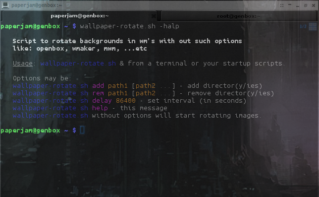
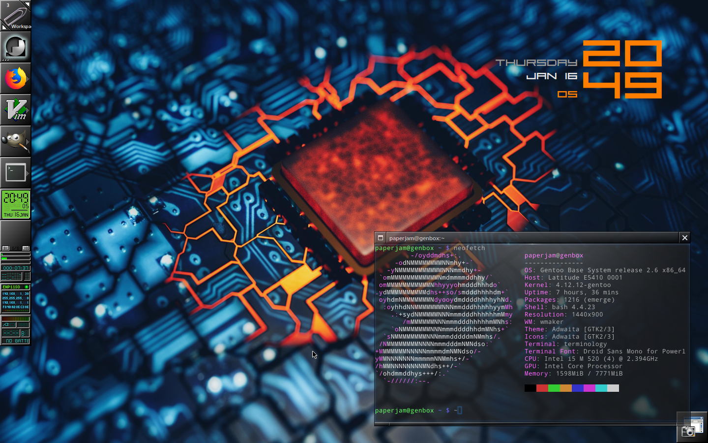
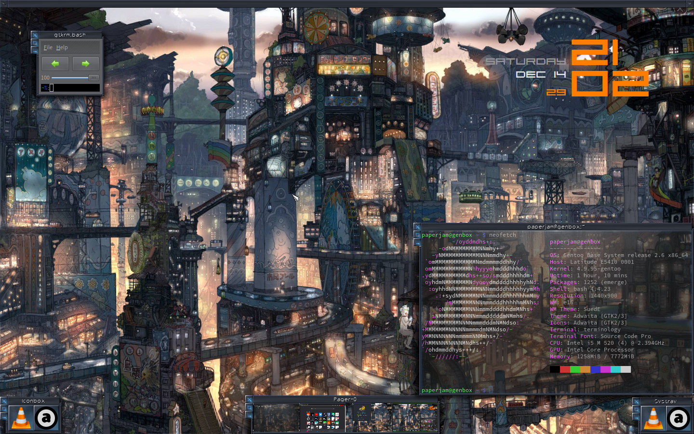
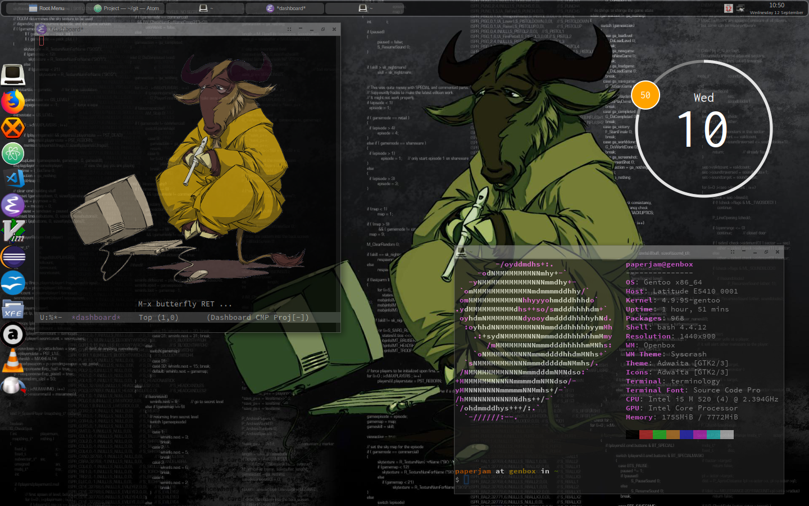
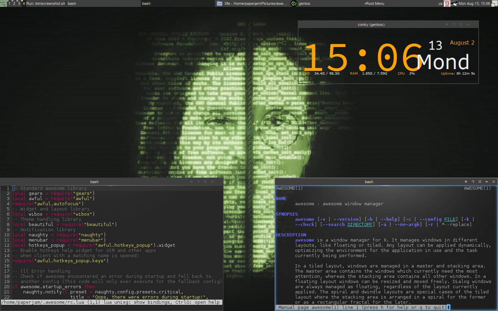
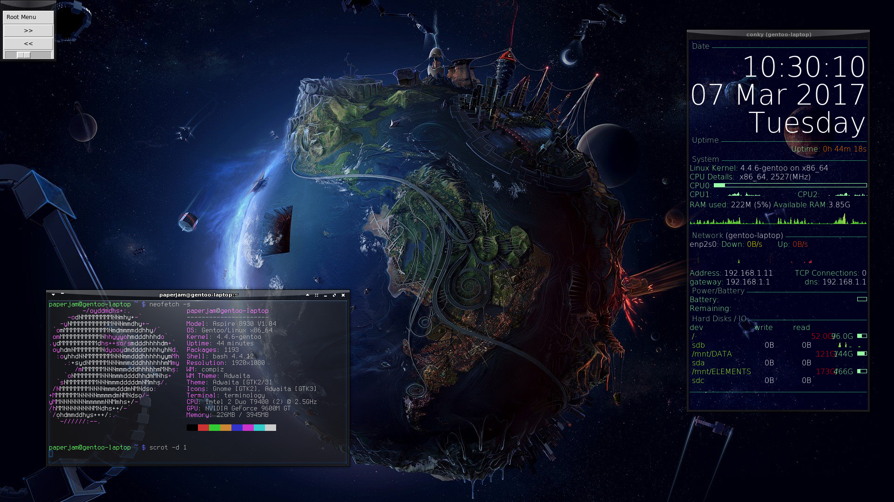
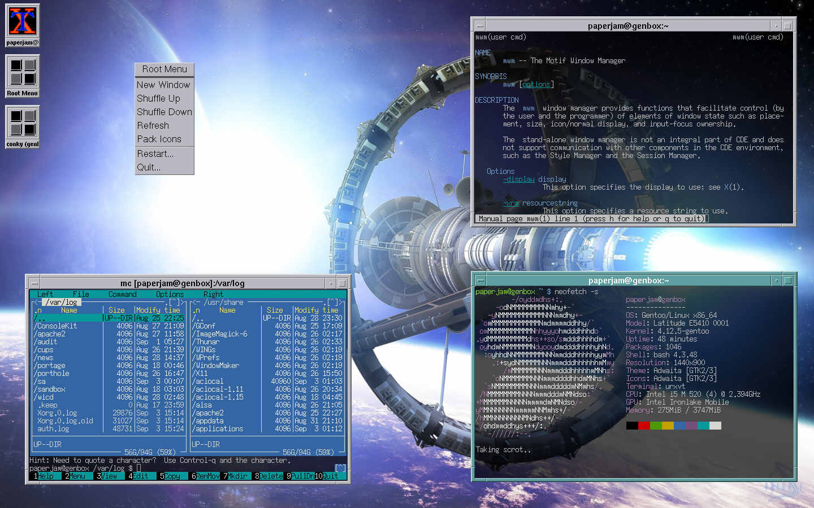

# 
mick's dots

 

  Possible use: "git clone https://github.com/MichaelTd/dots", go through the this repository and select what fits your needs so you can incorporate it in your working environment.

  My dots tend to be opinionated so take them with a grain of rice ...err SALT, I meant salt. Take them with a grain of salt.

## [dot.files](dot.files)

* [Shell](dot.files/.bash_profile), [X setup](dot.files/.xinitrc), [bin](dot.files/bin/), [sbin (maintenance scripts)](dot.files/sbin/)

  * [.bashrc.d](dot.files/.bashrc.d)
   Is a interactive shell initialization routine and it is customization of [Durag](http://dotshare.it/~Durag/)'s [Improved Terminal](http://dotshare.it/dots/1027/) at [http://dotshare.it/](http://dotshare.it/) with a prompt from [mathiasbynens](https://github.com/mathiasbynens/dotfiles)

  * [wallpaper-rotate.sh](dot.files/bin/wallpaper-rotate.sh)
   Script for rolling random images as wallpapers.
   I get my wallpapers from: [r/EarthPorn](https://www.reddit.com/r/EarthPorn/), [unsplash.com](https://unsplash.com/), [space.com](https://www.space.com/wallpapers), [wallup.net](https://wallup.net/), [wallpaperscraft.com](https://wallpaperscraft.com/)

  

  * [upgrade-distro.sh](dot.files/sbin/upgrade-distro.sh)
   Distro neutral upgrade script.

* Some WM's (in no particular order)

  * [wmaker](dot.files/GNUstep/)

  

  * [e16](dot.files/.e16/)

  

  * [openbox](dot.files/.config/openbox/)

  

  * [awesome](dot.files/.config/awesome/)

  

  * [compiz](dot.files/.config/compiz/)

  

  * [mwm](dot.files/.mwmrc)

  

  * [exwm](https://github.com/ch11ng/exwm/wiki) (cause reasons...)

  

 * Editors, [Utilities](dot.files/.tmux.conf).

   * If emacs is your "thing", check one of ...

     * https://github.com/technomancy/emacs-starter-kit
     * https://github.com/bbatsov/prelude
     * My setup consists of [a reasonable emacs config](https://github.com/purcell/emacs.d) and a [splashscreen](https://github.com/notarock/.emacs.d/blob/master/splash.png).

   * If vim is what makes you "tick", check out [SpaceVim](https://github.com/SpaceVim/SpaceVim), a community maintained vim distribution.

#### [bootstrap.sh](bootstrap.sh)
How I migrate my .dots in new systems. Don't use this unless you know exactly what you're getting into.

## Reference
#### [GitHub ❤ ~/](https://dotfiles.github.io/)
Your unofficial guide to dotfiles on GitHub.

#### [Advanced Bash Scripting Guide](http://www.tldp.org/LDP/abs/html/abs-guide.html) ([PDF](http://www.tldp.org/LDP/abs/abs-guide.pdf))
The Bash all in one goto place.

#### [EbookFoundation free-programming-books - bash](https://github.com/EbookFoundation/free-programming-books/blob/master/free-programming-books.md#bash)
Free books relevant to bash (and much more).

#### [bash-hackers wiki](http://wiki.bash-hackers.org/)
See what other fellow bash'ers are up to.
